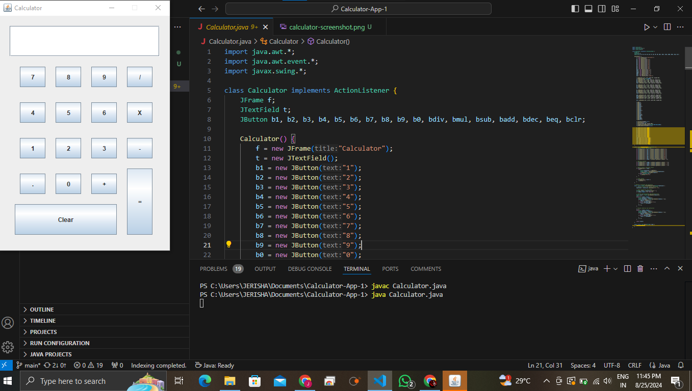

# Simple Java Calculator

This is a simple calculator application built using Java Swing. It provides basic arithmetic operations like addition, subtraction, multiplication, and division.

## Features

- **Basic Operations:** Addition, Subtraction, Multiplication, Division.
- **Clear Button:** Easily clear the input field for a fresh calculation.
- **Decimal Support:** Perform calculations with decimal numbers.

## How It Works

- The calculator has buttons for numbers (0-9), operators (+, -, *, /), and a decimal point.
- Enter the numbers and operators, and press `=` to see the result.
- Press `Clear` to reset the calculation.

## Code Structure

- **Calculator Class:** Implements the GUI and logic of the calculator using Java Swing.
- **ActionListener:** Handles button click events for the calculator.

## Getting Started

### Prerequisites

To run this project, you need:

- [Java JDK](https://www.oracle.com/java/technologies/javase-downloads.html) installed on your system.

### Running the Project

1. Clone the repository:

    ```bash
    git clone https://github.com/your-username/simple-java-calculator.git
    ```

2. Navigate to the project directory:

    ```bash
    cd simple-java-calculator
    ```

3. Compile and run the program:

    ```bash
    javac Calculator.java
    java Calculator
    ```

### Example Usage

1. Press the number buttons and operation buttons to create an expression.
2. Click `=` to evaluate the expression.
3. Use the `Clear` button to reset the input.

## Screenshots

## Screenshots




## Contributing

Feel free to submit issues or contribute by making a pull request. All contributions are welcome!

## License

This project is licensed under the MIT License - see the [LICENSE](LICENSE) file for details.
